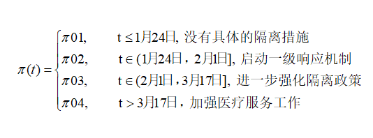

## **展示内容**


### 1.研究背景（少）


### 2.数据来源及模型简介（少）


### 3.实证分析（多，分自标题介绍）


### 4.展望（进一步再加一个模型）

---
class: inverse, middle, center

## 1. 背景及意义

---


---
class: inverse, middle, center

## 2. 描述性统计

---
  


---
class: inverse, middle, center

## 3. 实证分析

---
class:middle, center

### 修正疾病传播率的SIR模型

---

### 背景介绍

  由于中国政府实施了隔离政策，居民个人也进行了自我隔离，包含恒定传播率和移除率的基本流行病学模型并不适用于中国的实际情况。
  
  随着时间的推移，各种形式的干预措施正在改变着传输速率，例如：(1)让居民都戴口罩和安全眼镜，并采取在家隔离的措施(2)基层检疫，如对于感染人员立即住院隔离治疗，封锁城市，对交通实施控制以及限制各种形式的社交活动等。此外，病毒本身也可能发生变异而演变，从而增加疾病诊断中出现假阴性的潜在几率导致一些病毒携带者并没有被隔离。因此，传播速度β会随着时间发生变化，基于这种情况对基本的SIR模型做了相应的拓展(改变易感者接触到感染者的概率)。
  
```{r,echo=FALSE}
knitr::include_graphics("figures/1.png")

```

---

### 模型介绍

设t时刻, ${q^S}(t)$ 是易感染者在家隔离的概率, ${q^I}(t)$ 是感染者在医院的概率。新的模型中易感者与感染者相遇时的疾病传播率被修正为：


 $$\beta\lbrace 1-{q^S}(t)\rbrace{\theta_t}^S\lbrace1-{q^I}(t)\rbrace{\theta_t}^I$$


令 $\pi(t)=\lbrace 1-{q^S}(t)\rbrace\lbrace1-{q^I}(t)\rbrace$ 。 $\pi(t)$ 修正了易感者接触感染者的概率，它是由于存在隔离情况的存在而产生的。显然，如果不存在隔离措施，那么 $\pi(t)$ 恒为1。基于以上修正，得到新的SIR模型如下：
 $$\frac{d{\theta_t}^S }{dt} =-\beta \pi(t){\theta_t}^S {\theta_t}^I $$ 
 $$\frac{d{\theta_t}^I }{dt} =\beta \pi(t){\theta_t}^S {\theta_t}^I -\gamma {\theta_t}^I $$
 $$\frac{d{\theta_t}^R }{dt} = \gamma {\theta_t}^I $$


以上修正的SIR模型假定：总体的易感率和感染率是保持不变的，只是减少了易感者与感染者接触的概率 $\pi(t)$ 。

---

上述模型中疾病传播率的修正因子 $\pi(t)$  是根据地区所采取的隔离措施而特别给定的。 $\pi(t)$ 有可能是阶跃函数，可以反映不同时期政府采取的宏观隔离政策：

```{r,echo=FALSE}


```

当 $\pi_{0}=(\pi_{01},\pi_{02},\pi_{03},\pi_{04})$  选择不同的值时，疾病传播率也会不同。本次用的 $\pi_{0}$ 分别为(1,1,1,1),(1,0.9,0.7,0.5),(1,0.8,0.5,0.1)。

---

 $\pi(t)$ 也可以被定义为连续函数，可以反映大众稳定增加的自我隔离意识和不断增加的隔离方法，相比于上面所讲的阶跃函数，这是从微观(个人)的角度来反映隔离效应。 
 $\pi(t)$ 可以选择如下指数函数：

$$ \pi(t)=exp(-\lambda_0t) 或者 \pi(t)=exp\lbrace-(\lambda_0t)^v\rbrace $$

本次用的 $\lambda_0=0.05$ 。

---

### π0=(1,0.8,0.5,0.1)
```{r,eval=FALSE}
set.seed(20192020)
library(eSIR)
# cumulative number of infected
NI_complete <- c(5,14,22,26,36,51,68,80,91,111,132,156,183,
                212,228,253,274,297,315,326,337,342,352,366,                 372,375,380,381,387,393,395,396,399,399,399,                 400,400,410,410,411,413,414,414,417,418,422,                 426,428,428,429,435,435,436,415,415,415,415,                 415,415,415,415,415,415,416,416,416,416)
RI_complete <- c(0,0,0,0,1,2,2,3,5,5,6,6,10,13,24,25,32,
                34,36,39,46,51,59,71,82,101,109,118,126,149,
                157,17,182,193,202,219,239,253,264,279,284,
                290,296,302,305,306,311,316,323,328,334,342,
                350,357,361,366,374,377,381,386,393,399,400,
                400,400,400,402)
N=21.54e6
R <- RI_complete/N
Y <- NI_complete/N- R #Jan20->Mar26
### Step function of pi(t)
change_time <- c("01/24/2020","02/01/2020","03/17/2020")
pi0 <- c(1.0,0.8,0.5,0.1)
res.step <- tvt.eSIR(Y, R, begin_str="01/20/2020",
           death_in_R=0.035, T_fin=200,pi0=pi0,
           change_time=change_time, dic=T,
           casename="Beijing_step", save_files=T,                      save_mcmc=F, save_plot_data=F, M=5e3, 
           nburnin=2e3)
res.step$plot_infection
res.step$plot_removed
res.step$spaghetti_plot
res.step$dic_val
```
---

```{r,echo=FALSE}
knitr::include_graphics("figures/infection1.png")
knitr::include_graphics("figures/removed1.png")
```

---

### π0=(1,0.9,0.7,0.5)
```{r,eval=FALSE}
set.seed(20192020)
library(eSIR)
# cumulative number of infected
NI_complete <- c(5,14,22,26,36,51,68,80,91,111,132,156,183,
                212,228,253,274,297,315,326,337,342,352,366,                 372,375,380,381,387,393,395,396,399,399,399,                 400,400,410,410,411,413,414,414,417,418,422,                 426,428,428,429,435,435,436,415,415,415,415,                 415,415,415,415,415,415,416,416,416,416)
RI_complete <- c(0,0,0,0,1,2,2,3,5,5,6,6,10,13,24,25,32,
                34,36,39,46,51,59,71,82,101,109,118,126,149,
                157,17,182,193,202,219,239,253,264,279,284,
                290,296,302,305,306,311,316,323,328,334,342,
                350,357,361,366,374,377,381,386,393,399,400,
                400,400,400,402)
N=21.54e6
R <- RI_complete/N
Y <- NI_complete/N- R #Jan20->Mar26
### Step function of pi(t)
change_time <- c("01/24/2020","02/01/2020","03/17/2020")
pi0 <- c(1.0,0.9,0.7,0.5)
res.step <- tvt.eSIR(Y, R, begin_str="01/20/2020",
           death_in_R=0.035, T_fin=200,pi0=pi0,
           change_time=change_time, dic=T,
           casename="Beijing_step", save_files=T,                      save_mcmc=F, save_plot_data=F, M=5e3, 
           nburnin=2e3)
res.step$plot_infection
res.step$plot_removed
res.step$spaghetti_plot

```
---

```{r,echo=FALSE}
knitr::include_graphics("figures/infection2.png")
knitr::include_graphics("figures/removed2.png")
```

---

### the basic state-space SIR model, pi(t)=1
```{r,eval=FALSE}
set.seed(20192020)
library(eSIR)
# cumulative number of infected
NI_complete <- c(5,14,22,26,36,51,68,80,91,111,132,156,183,
                212,228,253,274,297,315,326,337,342,352,366,                 372,375,380,381,387,393,395,396,399,399,399,                 400,400,410,410,411,413,414,414,417,418,422,                 426,428,428,429,435,435,436,415,415,415,415,                 415,415,415,415,415,415,416,416,416,416)
RI_complete <- c(0,0,0,0,1,2,2,3,5,5,6,6,10,13,24,25,32,
                34,36,39,46,51,59,71,82,101,109,118,126,149,
                157,17,182,193,202,219,239,253,264,279,284,
                290,296,302,305,306,311,316,323,328,334,342,
                350,357,361,366,374,377,381,386,393,399,400,
                400,400,400,402)
N=21.54e6
R <- RI_complete/N
Y <- NI_complete/N- R #Jan20->Mar26
### Step function of pi(t)
res.nopi <- tvt.eSIR(Y, R, begin_str="01/20/2020",
            death_in_R=0.035, T_fin=200,                                casename="Beijing_nopi", save_files=T,
            M=5e2, nburnin = 2e2)
res.nopi$plot_infection
res.nopi$plot_removed    

```
---

```{r,echo=FALSE}
knitr::include_graphics("figures/infection3.png")
knitr::include_graphics("figures/removed3.png")
```

---

###  exponential function pi(t)
```{r,eval=FALSE}
set.seed(20192020)
library(eSIR)
# cumulative number of infected
NI_complete <- c(5,14,22,26,36,51,68,80,91,111,132,156,183,
                212,228,253,274,297,315,326,337,342,352,366,                 372,375,380,381,387,393,395,396,399,399,399,                 400,400,410,410,411,413,414,414,417,418,422,                 426,428,428,429,435,435,436,415,415,415,415,                 415,415,415,415,415,415,416,416,416,416)
RI_complete <- c(0,0,0,0,1,2,2,3,5,5,6,6,10,13,24,25,32,
                34,36,39,46,51,59,71,82,101,109,118,126,149,
                157,17,182,193,202,219,239,253,264,279,284,
                290,296,302,305,306,311,316,323,328,334,342,
                350,357,361,366,374,377,381,386,393,399,400,
                400,400,400,402)
N=21.54e6
R <- RI_complete/N
Y <- NI_complete/N- R #Jan20->Mar26
### Step function of pi(t)
res.exp <- tvt.eSIR(Y, R, begin_str="01/20/2020",
           death_in_R=0.035, T_fin=200, exponential=TRUE,
           dic=F, lambda0=0.05, casename="Beijing_exp",
           save_files=T, save_mcmc=F, M=5e2, nburnin = 2e2)
res.nopi$plot_infection
res.nopi$plot_removed    

```
---

```{r,echo=FALSE}
knitr::include_graphics("figures/infection4.png")
knitr::include_graphics("figures/removed4.png")
```

---
class: inverse, middle, center

## 4. 展望

---