---
title: "细化政府干预的北京疫情预测"
subtitle: "中期报告"
author: "武碧璇 张妍 祁凡 屈亚然 丁晨东"
date: "2020年05月08日"
output:
  xaringan::moon_reader:
    css: [default, zh-CN.css]
    lib_dir: libs
    nature:
      highlightStyle: github
      highlightLines: true
      countIncrementalSlides: false
---


## **展示内容**


### 1.绪论


### 2.描述统计


### 3.实证分析


### 4.问题与展望

---
class: inverse, middle, center

## 1. 绪论

---
## **背景与意义**

  这次疫情，是新中国成立以来在我国发生的传播速度最快、感染范围最广、防控难度最大的一次重大突发公共卫生事件。
  
  这次疫情，是一次世界危机、全球灾难。迄今，全球确诊病例近400万例，疫情波及几百个国家和地区……新冠肺炎疫情让世界几乎每个角落都感受到了它的影响。而北京作为我们国家的首都和中心城市，是中国的政治、文化、科教和国际交流中心，由于国际疫情形势日益严峻，北京外来人员流动频繁，因此政府对于易感者、感染者以及移除者的这三个人群的防控显得尤为重要，所以研究北京政府干预对于疫情的影响有重大意义。
   
   本次报告利用了宋学坤教授团队的eSIR包对北京市的疫情做了预测，并对预测效果进行了评估，这对于eSIR包在以后流行病预测中的应用具有一定的意义。
  

---
## **文献综述**

[1].马尔科夫链在传染病预测中的应用
<https://wenku.baidu.com/view/e2ec6a0f76c66137ee06191a.html>.

论文提出利用马尔可夫链建立传染病预测模型，根据辽宁省干旱地区朝阳市1981年至1993年流行性脑脊髓膜炎的年发病率资料对该预测模型进行了验证,从而得出马尔可夫链传染病预测模型的可靠性以及可信度。

[2].朱仁杰,唐仕浩,刘彤彤,等.基于改进SIR模型的新型冠状病毒肺炎疫情预测及防控对疫情发展的影响.

论文利用改进的SIR模型对7个疫情较为严重的国家的疫情的发展情况进行模拟和预测，并分析各国控制接触率等防治措施对于疫情发展的影响。

[3].An epidemiological forecast model and software assessing interventions on COVID-19 epidemic in China.

论文利用中国疾病预防控制中心的公开数据，了解湖北省和中国其他地区的冠状病毒流行趋势。通过R软件为公众提供了一个工具包eSIR，以便他们使用自己的数据分析疾病传播模式。

  
---

## **eSIR包的介绍**

   eSIR包是由宋学坤教授团队开发的，公共卫生工作者可以用它来预测和评估新型冠状病毒传播趋势动态变化过程。该包可以用来预测疫情的转折点，比如感染比例比之前下降的时间点，感染比例比移除比例小的时间点以及疫情结束的时间点。eSIR包是建立在一个分级流行病模型的基础上的，在该模型中每日感染者和移除者的比例来自于基于马尔可夫过程的传染病动力学SIR模型。该包不仅对基本的SIR模型做了拓展，考虑了宏观层面和微观层面的隔离政策，而且还开发了一个校准程序对2月12日及以前的感染者数量进行调整,以此来降低由于漏报问题导致的预测偏差。（校准主要是因为此期间政府只依赖于核酸检测来诊断，但检测经常出现假阴性问题）


---
## **数据来源及政府干预政策**

1.**数据来源**：来自狗熊会


北京市1月20-3月26的数据，包括累计确诊人数，累计治愈和累计死亡人数，以及移除人数(累计治愈人数+累计死亡人数)。  

2.**政策**：来自北京市人民政府<http://www.beijing.gov.cn/ywdt/zwzt/yqfk/>
  

**·**1月24日，北京启动一级响应机制

**·**1月24日-2月1日，交通管制（包括暂停进出北京的长途客运班线和旅游包车，北京铁路局部分旅客列车临时停运，地铁和北京西站实行测温等）

**·**2月1日-3月17日，更进一步的隔离措施（包括各个机构和社区均进行封闭式管理等）
 
**·**3月17日及以后，开展预防接种工作，加强医疗服务工作等
 

---
class: inverse, middle, center

## 2. 描述性统计

---
  


---
class: inverse, middle, center

## 3. 实证分析

---
class:middle, center

### 修正疾病传播率的SIR模型

---

### 背景介绍

  由于中国政府实施了隔离政策，居民个人也进行了自我隔离，包含恒定传播率和移除率的基本流行病学模型并不适用于中国的实际情况。
  
  随着时间的推移，各种形式的干预措施正在改变着传输速率，例如：(1)让居民都戴口罩和安全眼镜，并采取在家隔离的措施(2)基层检疫，如对于感染人员立即住院隔离治疗，封锁城市，对交通实施控制以及限制各种形式的社交活动等。此外，病毒本身也可能发生变异而演变，从而增加疾病诊断中出现假阴性的潜在几率导致一些病毒携带者并没有被隔离。因此，传播速度β会随着时间发生变化，基于这种情况对基本的SIR模型做了相应的拓展(改变易感者接触到感染者的概率)。
  
```{r,echo=FALSE}

```


---

### 模型简介

设t时刻, ${q^S}(t)$ 是易感染者在家隔离的概率, ${q^I}(t)$ 是感染者在医院的概率。新的模型中易感者与感染者相遇时的疾病传播率被修正为：


 $$\beta\lbrace 1-{q^S}(t)\rbrace{\theta_t}^S\lbrace1-{q^I}(t)\rbrace{\theta_t}^I$$


令 $\pi(t)=\lbrace 1-{q^S}(t)\rbrace\lbrace1-{q^I}(t)\rbrace$ 。 $\pi(t)$ 修正了易感者接触感染者的概率，它是由于存在隔离情况的存在而产生的。显然，如果不存在隔离措施，那么 $\pi(t)$ 恒为1。基于以上修正，得到新的SIR模型如下：
 $$\frac{d{\theta_t}^S }{dt} =-\beta \pi(t){\theta_t}^S {\theta_t}^I $$ 
 $$\frac{d{\theta_t}^I }{dt} =\beta \pi(t){\theta_t}^S {\theta_t}^I -\gamma {\theta_t}^I $$
 $$\frac{d{\theta_t}^R }{dt} = \gamma {\theta_t}^I $$


以上修正的SIR模型假定：总体的易感率和感染率是保持不变的，只是减少了易感者与感染者接触的概率 $\pi(t)$ 。

---

上述模型中疾病传播率的修正因子 $\pi(t)$  是根据地区所采取的隔离措施而特别给定的。 $\pi(t)$ 有可能是阶跃函数，可以反映不同时期政府采取的宏观隔离政策：

```{r,echo=FALSE}
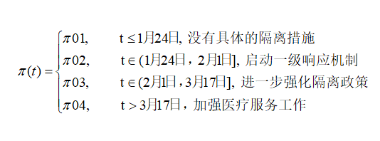

```

当 $\pi_{0}=(\pi_{01},\pi_{02},\pi_{03},\pi_{04})$  选择不同的值时，疾病传播率也会不同。本次用的 $\pi_{0}$ 分别为(1,1,1,1),(1,0.9,0.7,0.5),(1,0.8,0.5,0.1)。

---

 $\pi(t)$ 也可以被定义为连续函数，可以反映大众稳定增加的自我隔离意识和不断增加的隔离方法，相比于上面所讲的阶跃函数，这是从微观(个人)的角度来反映隔离效应。 
 $\pi(t)$ 可以选择如下指数函数：

$$ \pi(t)=exp(-\lambda_0t) 或者 \pi(t)=exp\lbrace-(\lambda_0t)^v\rbrace $$

本次用的 $\lambda_0=0.05$ 。

---
### the basic state-space SIR model, pi(t)=1

```{r,eval=FALSE}
set.seed(20192020)
library(eSIR)
# cumulative number of infected
NI_complete <- c(5,14,22,26,36,51,68,80,91,111,132,156,183,
                212,228,253,274,297,315,326,337,342,352,366,                 372,375,380,381,387,393,395,396,399,399,399,                 400,400,410,410,411,413,414,414,417,418,422,                 426,428,428,429,435,435,436,415,415,415,415,                 415,415,415,415,415,415,416,416,416,416)
RI_complete <- c(0,0,0,0,1,2,2,3,5,5,6,6,10,13,24,25,32,
                34,36,39,46,51,59,71,82,101,109,118,126,149,
                157,17,182,193,202,219,239,253,264,279,284,
                290,296,302,305,306,311,316,323,328,334,342,
                350,357,361,366,374,377,381,386,393,399,400,
                400,400,400,402)
N=21.54e6
R <- RI_complete/N
Y <- NI_complete/N- R #Jan20->Mar26
### Step function of pi(t)
res.nopi <- tvt.eSIR(Y, R, begin_str="01/20/2020",
            death_in_R=0.035, T_fin=200,                                casename="Beijing_nopi", save_files=T,
            M=5e2, nburnin = 2e2)
res.nopi$plot_infection
res.nopi$plot_removed    

```
---

### 参数介绍

Y：每日观察到的感染人群时间序列。

R：每日观察到的移除人群比例的时间序列，包括死亡和康复。

begin_str：起始日期。

T-fin:从数据起始日期开始，分析研究的天数；默认为两百天，即T-fin=200。

nadapt:MCMC中自适应的迭代次数，至少使用默认值1e4确保可以获得完全适应链。

death_in_R:转移区内累计死亡平均数的数值，默认为北京市为0.035。

---

```{r,echo=FALSE}
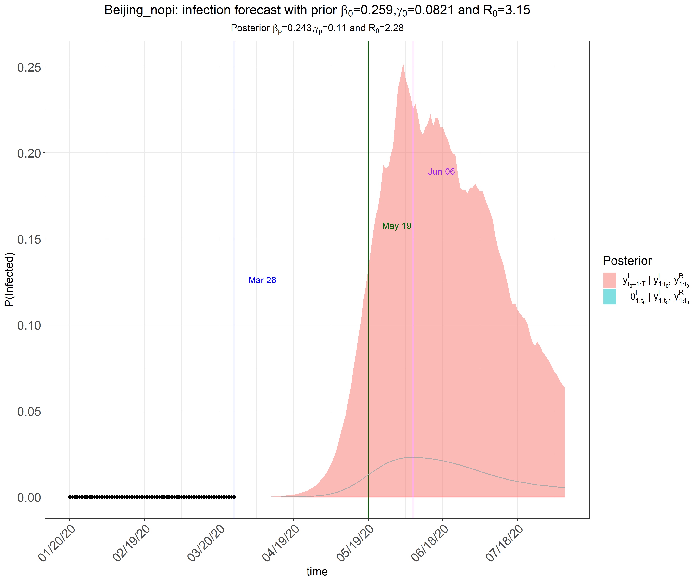
```

---
```{r,echo=FALSE}
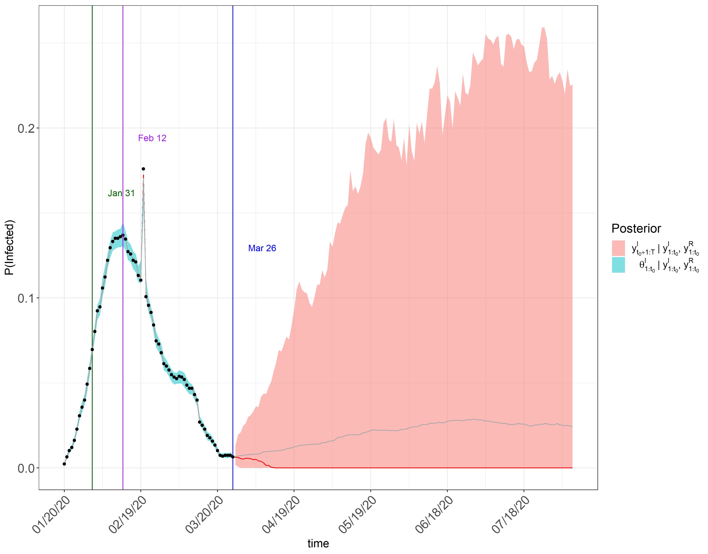
```

---

```{r,echo=FALSE}
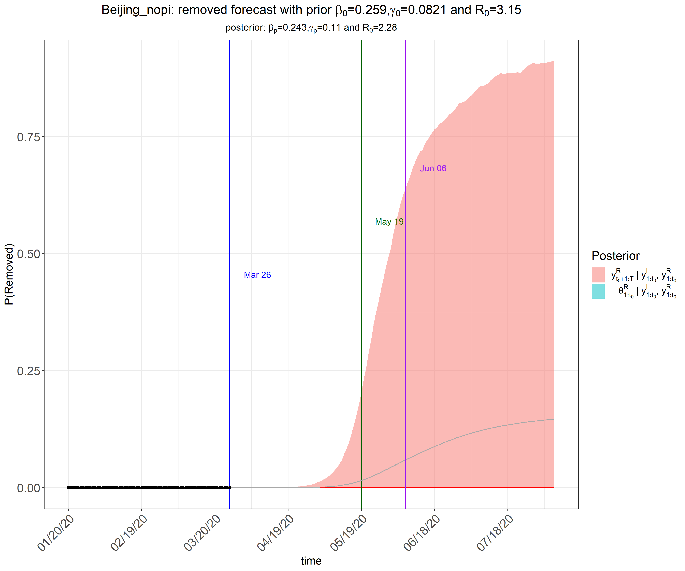
```

---

### π0=(1,0.8,0.5,0.1)
```{r,eval=FALSE}
set.seed(20192020)
library(eSIR)
# cumulative number of infected
NI_complete <- c(5,14,22,26,36,51,68,80,91,111,132,156,183,
                212,228,253,274,297,315,326,337,342,352,366,                 372,375,380,381,387,393,395,396,399,399,399,                 400,400,410,410,411,413,414,414,417,418,422,                 426,428,428,429,435,435,436,415,415,415,415,                 415,415,415,415,415,415,416,416,416,416)
RI_complete <- c(0,0,0,0,1,2,2,3,5,5,6,6,10,13,24,25,32,
                34,36,39,46,51,59,71,82,101,109,118,126,149,
                157,17,182,193,202,219,239,253,264,279,284,
                290,296,302,305,306,311,316,323,328,334,342,
                350,357,361,366,374,377,381,386,393,399,400,
                400,400,400,402)
N=21.54e6
R <- RI_complete/N
Y <- NI_complete/N- R #Jan20->Mar26
### Step function of pi(t)
change_time <- c("01/24/2020","02/01/2020","03/17/2020")
pi0 <- c(1.0,0.8,0.5,0.1)
res.step <- tvt.eSIR(Y, R, begin_str="01/20/2020",
           death_in_R=0.035, T_fin=200,pi0=pi0,
           change_time=change_time, dic=T,
           casename="Beijing_step", save_files=T,                      save_mcmc=F, save_plot_data=F, M=5e3, 
           nburnin=2e3)
res.step$plot_infection
res.step$plot_removed
res.step$spaghetti_plot
res.step$dic_val
```

---

```{r,echo=FALSE}
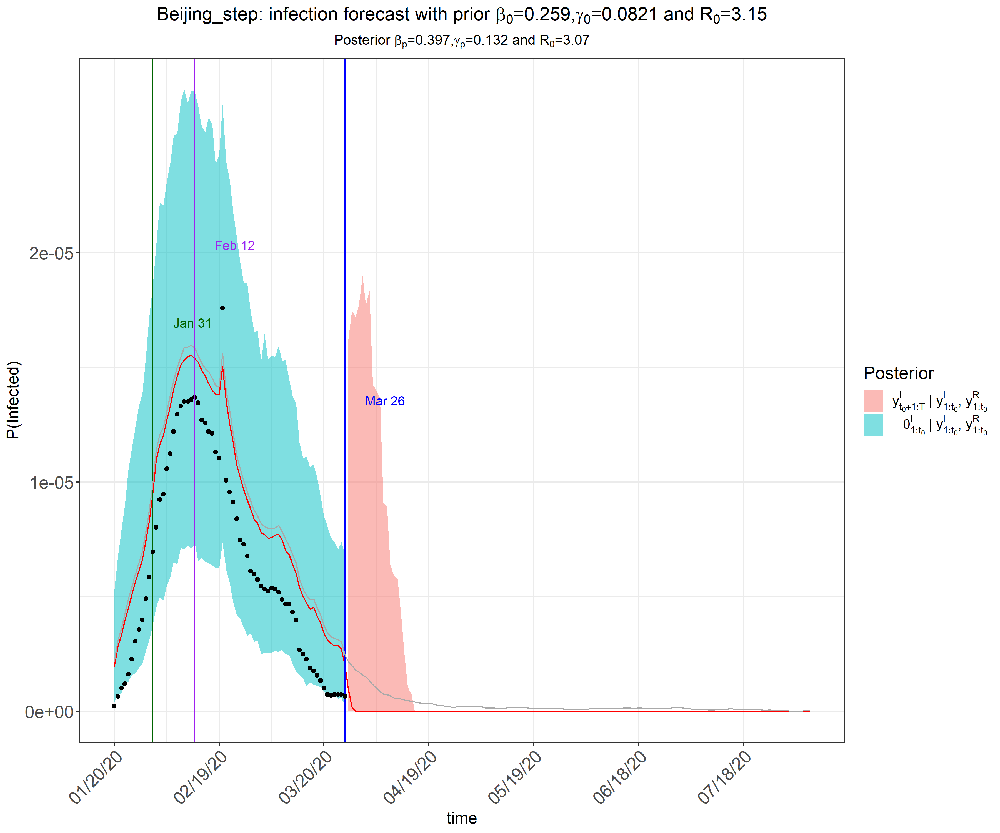
```

---
```{r,echo=FALSE}
knitr::include_graphics("figures/removed1.png")
```

---
### π0=(1,0.9,0.7,0.5)
```{r,eval=FALSE}
set.seed(20192020)
library(eSIR)
# cumulative number of infected
NI_complete <- c(5,14,22,26,36,51,68,80,91,111,132,156,183,
                212,228,253,274,297,315,326,337,342,352,366,                 372,375,380,381,387,393,395,396,399,399,399,                 400,400,410,410,411,413,414,414,417,418,422,                 426,428,428,429,435,435,436,415,415,415,415,                 415,415,415,415,415,415,416,416,416,416)
RI_complete <- c(0,0,0,0,1,2,2,3,5,5,6,6,10,13,24,25,32,
                34,36,39,46,51,59,71,82,101,109,118,126,149,
                157,17,182,193,202,219,239,253,264,279,284,
                290,296,302,305,306,311,316,323,328,334,342,
                350,357,361,366,374,377,381,386,393,399,400,
                400,400,400,402)
N=21.54e6
R <- RI_complete/N
Y <- NI_complete/N- R #Jan20->Mar26
### Step function of pi(t)
change_time <- c("01/24/2020","02/01/2020","03/17/2020")
pi0 <- c(1.0,0.9,0.7,0.5)
res.step <- tvt.eSIR(Y, R, begin_str="01/20/2020",
           death_in_R=0.035, T_fin=200,pi0=pi0,
           change_time=change_time, dic=T,
           casename="Beijing_step", save_files=T,                      save_mcmc=F, save_plot_data=F, M=5e3, 
           nburnin=2e3)
res.step$plot_infection
res.step$plot_removed
res.step$spaghetti_plot

```
---

```{r,echo=FALSE}
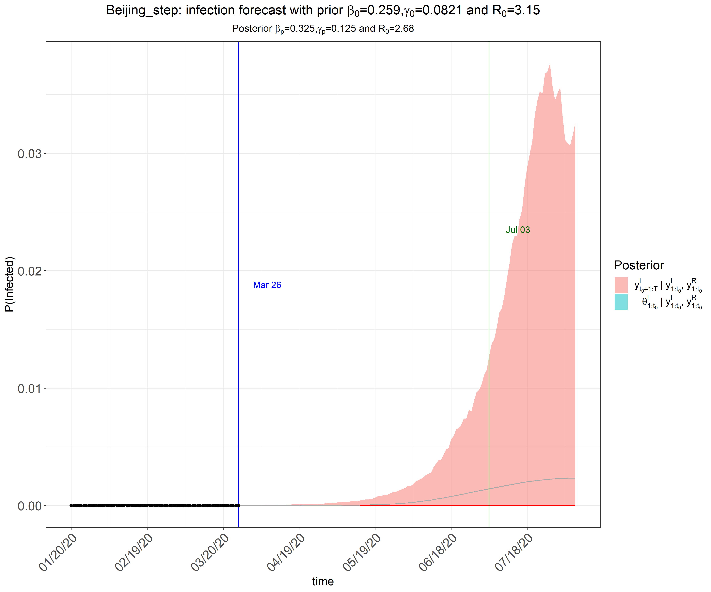
```

---
```{r,echo=FALSE}
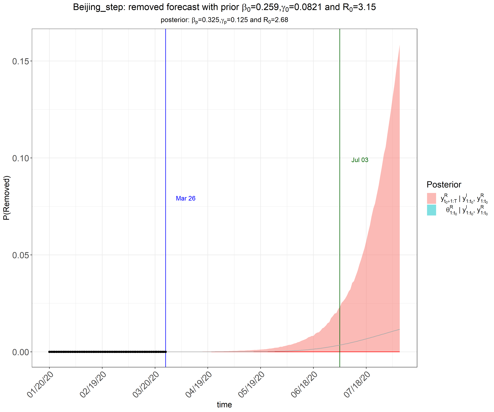
```

---

###  exponential function pi(t)
```{r,eval=FALSE}
set.seed(20192020)
library(eSIR)
# cumulative number of infected
NI_complete <- c(5,14,22,26,36,51,68,80,91,111,132,156,183,
                212,228,253,274,297,315,326,337,342,352,366,                 372,375,380,381,387,393,395,396,399,399,399,                 400,400,410,410,411,413,414,414,417,418,422,                 426,428,428,429,435,435,436,415,415,415,415,                 415,415,415,415,415,415,416,416,416,416)
RI_complete <- c(0,0,0,0,1,2,2,3,5,5,6,6,10,13,24,25,32,
                34,36,39,46,51,59,71,82,101,109,118,126,149,
                157,17,182,193,202,219,239,253,264,279,284,
                290,296,302,305,306,311,316,323,328,334,342,
                350,357,361,366,374,377,381,386,393,399,400,
                400,400,400,402)
N=21.54e6
R <- RI_complete/N
Y <- NI_complete/N- R #Jan20->Mar26
### Step function of pi(t)
res.exp <- tvt.eSIR(Y, R, begin_str="01/20/2020",
           death_in_R=0.035, T_fin=200, exponential=TRUE,
           dic=F, lambda0=0.05, casename="Beijing_exp",
           save_files=T, save_mcmc=F, M=5e2, nburnin = 2e2)
res.nopi$plot_infection
res.nopi$plot_removed    

```
---

```{r,echo=FALSE}
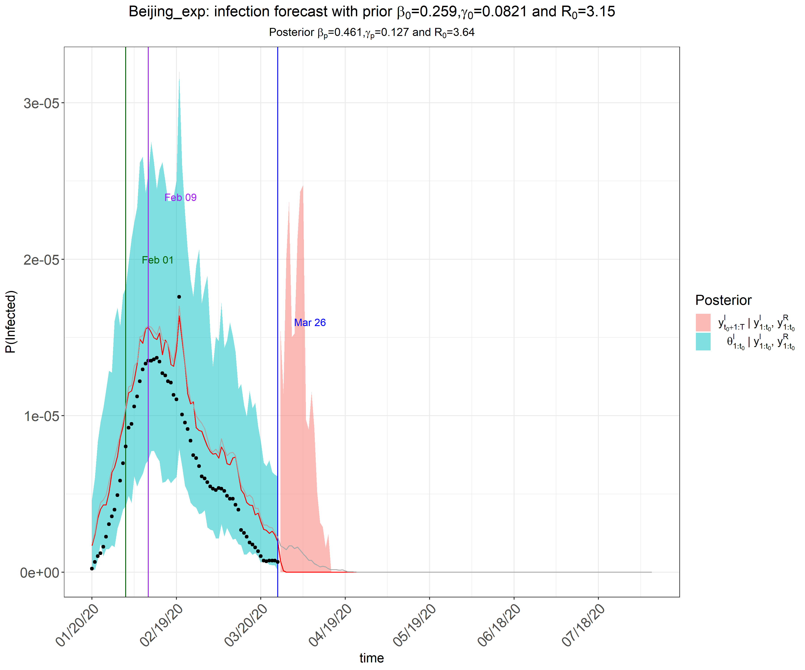
```

---

```{r,echo=FALSE}
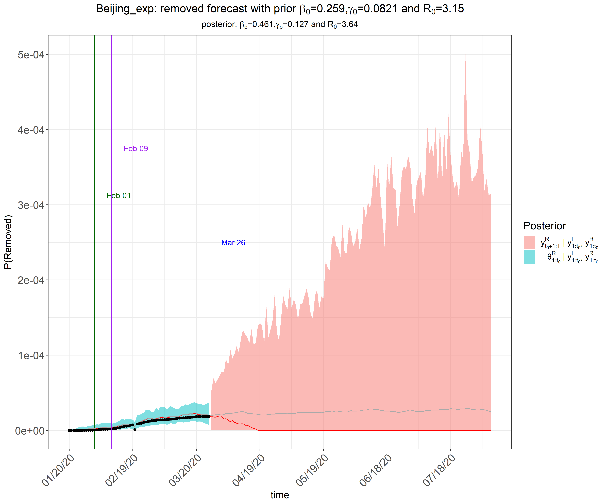
```

---
class: inverse, middle, center

## 4. 问题与展望

---

### 问题

在模型分析中发现，该模型使用具有较强的时效性。SIR模型多用来预测疫情拐点，以及在本文中研究政策对于疫情的影响。选题之处，北京市疫情尚未出现拐点，预测拐点及研究政策就显得尤为重要。但就当前而言，北京市疫情早已得到有效控制，于3月13日出现拐点。此时研究政府干预与自然状态下疫情的发展变化情况，意义甚微。

### 展望

本次使用数据为1月20日至3月26日的数据，可多次改变起始时间及时间长度；探究以数据为导向的政策赋权，减少人为赋权影响。


=======
---
title: "细化政府干预的北京疫情预测"
subtitle: "中期报告"
author: "武碧璇 张妍 祁凡 屈亚然 丁晨东"
date: "2020年05月08日"
output:
  xaringan::moon_reader:
    css: [default, zh-CN.css]
    lib_dir: libs
    nature:
      highlightStyle: github
      highlightLines: true
      countIncrementalSlides: false
---


## **展示内容**


### 1.绪论


### 2.描述统计


### 3.实证分析


### 4.问题与展望

---
class: inverse, middle, center

## 1. 绪论

---
## **背景与意义**

  这次疫情，是新中国成立以来在我国发生的传播速度最快、感染范围最广、防控难度最大的一次重大突发公共卫生事件。
  
  这次疫情，是一次世界危机、全球灾难。迄今，全球确诊病例近400万例，疫情波及几百个国家和地区……新冠肺炎疫情让世界几乎每个角落都感受到了它的影响。而北京作为我们国家的首都和中心城市，是中国的政治、文化、科教和国际交流中心，由于国际疫情形势日益严峻，北京外来人员流动频繁，因此政府对于易感者、感染者以及移除者的这三个人群的防控显得尤为重要，所以研究北京政府干预对于疫情的影响有重大意义。
   
   本次报告利用了宋学坤教授团队的eSIR包对北京市的疫情做了预测，并对预测效果进行了评估，这对于eSIR包在以后流行病预测中的应用具有一定的意义。
  

---
## **文献综述**

[1].马尔科夫链在传染病预测中的应用
<https://wenku.baidu.com/view/e2ec6a0f76c66137ee06191a.html>.

论文提出利用马尔可夫链建立传染病预测模型，根据辽宁省干旱地区朝阳市1981年至1993年流行性脑脊髓膜炎的年发病率资料对该预测模型进行了验证,从而得出马尔可夫链传染病预测模型的可靠性以及可信度。

[2].朱仁杰,唐仕浩,刘彤彤,等.基于改进SIR模型的新型冠状病毒肺炎疫情预测及防控对疫情发展的影响.

论文利用改进的SIR模型对7个疫情较为严重的国家的疫情的发展情况进行模拟和预测，并分析各国控制接触率等防治措施对于疫情发展的影响。

[3].An epidemiological forecast model and software assessing interventions on COVID-19 epidemic in China.

论文利用中国疾病预防控制中心的公开数据，了解湖北省和中国其他地区的冠状病毒流行趋势。通过R软件为公众提供了一个工具包eSIR，以便他们使用自己的数据分析疾病传播模式。

  
---

## **eSIR包的介绍**

   eSIR包是由宋学坤教授团队开发的，公共卫生工作者可以用它来预测和评估新型冠状病毒传播趋势动态变化过程。该包可以用来预测疫情的转折点，比如感染比例比之前下降的时间点，感染比例比移除比例小的时间点以及疫情结束的时间点。eSIR包是建立在一个分级流行病模型的基础上的，在该模型中每日感染者和移除者的比例来自于基于马尔可夫过程的传染病动力学SIR模型。该包不仅对基本的SIR模型做了拓展，考虑了宏观层面和微观层面的隔离政策，而且还开发了一个校准程序对2月12日及以前的感染者数量进行调整,以此来降低由于漏报问题导致的预测偏差。（校准主要是因为此期间政府只依赖于核酸检测来诊断，但检测经常出现假阴性问题）


---
## **数据来源及政府干预政策**

1.**数据来源**：来自狗熊会


北京市1月20-3月26的数据，包括累计确诊人数，累计治愈和累计死亡人数，以及移除人数(累计治愈人数+累计死亡人数)。  

2.**政策**：来自北京市人民政府<http://www.beijing.gov.cn/ywdt/zwzt/yqfk/>
  

**·**1月24日，北京启动一级响应机制

**·**1月24日-2月1日，交通管制（包括暂停进出北京的长途客运班线和旅游包车，北京铁路局部分旅客列车临时停运，地铁和北京西站实行测温等）

**·**2月1日-3月17日，更进一步的隔离措施（包括各个机构和社区均进行封闭式管理等）
 
**·**3月17日及以后，开展预防接种工作，加强医疗服务工作等
 

---
class: inverse, middle, center

## 2. 描述性统计

---
###nCov2019以及Chinamap的安装


https://github.com/GuangchuangYu/nCov2019


https://github.com/GuangchuangYu/chinamap


从Github上下载zip压缩文件，在本地R studio中安装


```{r, eval =FALSE}
devtools::install_local("nCov2019-master.zip")
```


```{r, eval =FALSE}
devtools::install_local("chinamap-master.zip")
```
---
###北京市感染趋势情况
```{r,echo = F,message=FALSE}
h <- read.table(file="confirm.csv",sep = ",",header = T)
library(zoo)
library(xts)
hh <- xts(h$number,as.Date(h$time, format='%Y/%m/%d'))
win.graph(width = 9.5,height = 5.5,pointsize = 15)
p<-plot(hh,type='l',main='')
p
```
&ensp; &ensp;&ensp;&ensp;<font size=6>自1月20日起，北京市陆续出现确诊感染病例，疫情在1月24日至2月12日达到了爆发期。2月12日后，感染人数增速放缓，北京市疫情出现拐点。

---
##北京市确诊人数和治愈人数时序图
```{r echo=F,message=FALSE}
h <- read.table(file="Beijingdata.csv",sep = ",",header = T)
library(zoo)
library(xts)
options(warn=-1)
qz<-xts(h$confirmed, as.Date(h$date, format='%m/%d'))
cy<-xts(h$cure, as.Date(h$date, format='%m/%d'))
win.graph(width = 9.5,height = 5.5,pointsize = 15)
plot(qz,type='l',main ='',col="blue")
lines(cy,type='l',main ='',col="red")
```
---

##确诊人数与出院人数
```{r echo=F,message=FALSE}
ch <- read.table(file="Beijingdata.csv",sep = ",",header = T)
library(zoo)
library(xts)
options(warn=-1)
qz<-xts(ch$xzqz, as.Date(h$date, format='%m/%d'))
cy<-xts(ch$xzcy, as.Date(h$date, format='%m/%d'))
win.graph(width = 9.5,height = 5.5,pointsize = 15)
plot(qz,type='l',main ='',col="blue")
lines(cy,type='l',main ='',col="red")
```
&ensp; &ensp;&ensp;&ensp;<font size=6>自2月4日起，北京市新增确诊人数逐渐减少。2月3日起，新增出院人数逐渐增加；2月24日起，北京本地疫情基本得到控制。

---
###北京各区感染情况
```{r echo=F,message=FALSE}
library(nCov2019)
x <- get_nCov2019()
library(forcats)
library(ggplot2)
d = x['北京',]
d$confirm=as.numeric(d$confirm)
d$name = fct_reorder(d$name, d$confirm)

ggplot(d, aes(name, confirm)) + 
  geom_col(fill='steelblue') + coord_flip() +
  geom_text(aes(y = confirm+2, label=confirm), hjust=0) +
  theme_minimal(base_size=14) + 
  scale_y_continuous(expand=c(0,10)) +
  xlab(NULL) + ylab(NULL)
```

---
  
###北京各区确诊人数曲线图
<div align=center>
```{r,echo=FALSE}
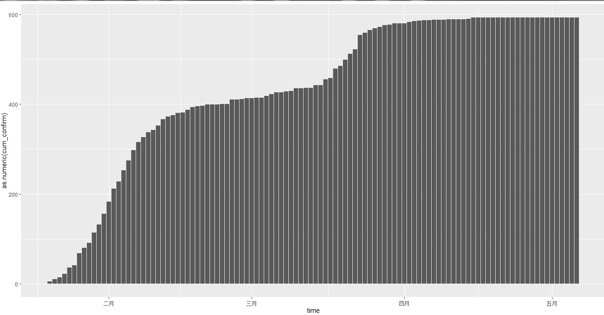
```

  
---
class: inverse, middle, center

## 3. 实证分析

---
class:middle, center

### 修正疾病传播率的SIR模型

---

### 背景介绍

&emsp;&emsp;由于中国政府实施了隔离政策，居民个人也进行了自我隔离，包含恒定传播率和移除率的基本流行病学模型并不适用于中国的实际情况。
  
&emsp;&emsp;随着时间的推移，各种形式的干预措施正在改变着传输速率，例如：(1)让居民都戴口罩和安全眼镜，并采取在家隔离的措施(2)基层检疫，如对于感染人员立即住院隔离治疗，封锁城市，对交通实施控制以及限制各种形式的社交活动等。此外，病毒本身也可能发生变异而演变，从而增加疾病诊断中出现假阴性的潜在几率导致一些病毒携带者并没有被隔离。因此，传播速度β会随着时间发生变化，基于这种情况对基本的SIR模型做了相应的拓展(改变易感者接触到感染者的概率)。
  
```{r,echo=FALSE}

```


---

### 模型简介

&emsp;&emsp;设t时刻, ${q^S}(t)$ 是易感染者在家隔离的概率, ${q^I}(t)$ 是感染者在医院的概率。新的模型中易感者与感染者相遇时的疾病传播率被修正为：


 $$\beta\lbrace 1-{q^S}(t)\rbrace{\theta_t}^S\lbrace1-{q^I}(t)\rbrace{\theta_t}^I$$


&emsp;&emsp;令 $\pi(t)=\lbrace 1-{q^S}(t)\rbrace\lbrace1-{q^I}(t)\rbrace$ 。 $\pi(t)$ 修正了易感者接触感染者的概率，它是由于存在隔离情况的存在而产生的。显然，如果不存在隔离措施，那么 $\pi(t)$ 恒为1。基于以上修正，得到新的SIR模型如下：
 $$\frac{d{\theta_t}^S }{dt} =-\beta \pi(t){\theta_t}^S {\theta_t}^I $$ 
 $$\frac{d{\theta_t}^I }{dt} =\beta \pi(t){\theta_t}^S {\theta_t}^I -\gamma {\theta_t}^I $$
 $$\frac{d{\theta_t}^R }{dt} = \gamma {\theta_t}^I $$


&emsp;&emsp;以上修正的SIR模型假定：总体的易感率和感染率是保持不变的，只是减少了易感者与感染者接触的概率 $\pi(t)$ 。

---

&emsp;&emsp;上述模型中疾病传播率的修正因子 $\pi(t)$  是根据地区所采取的隔离措施而特别给定的。 $\pi(t)$ 有可能是阶跃函数，可以反映不同时期政府采取的宏观隔离政策：

```{r,echo=FALSE}


```

&emsp;&emsp;当 $\pi_{0}=(\pi_{01},\pi_{02},\pi_{03},\pi_{04})$  选择不同的值时，疾病传播率也会不同。本次用的 $\pi_{0}$ 分别为(1,1,1,1),(1,0.8,0.5,0.1),(1,0.9,0.7,0.5)。

---

&emsp;&emsp; $\pi(t)$ 也可以被定义为连续函数，可以反映大众稳定增加的自我隔离意识和不断增加的隔离方法，相比于上面所讲的阶跃函数，这是从微观(个人)的角度来反映隔离效应。 
 $\pi(t)$ 可以选择如下指数函数：

$$ \pi(t)=exp(-\lambda_0t) 或者 \pi(t)=exp\lbrace-(\lambda_0t)^v\rbrace $$

&emsp;&emsp;本次用的 $\lambda_0=0.05$ 。

---
### the basic state-space SIR model, pi(t)=1

```{r,eval=FALSE}
set.seed(20192020)
library(eSIR)
# cumulative number of infected
NI_complete <- c(5,14,22,26,36,51,68,80,91,111,132,156,183,
                212,228,253,274,297,315,326,337,342,352,366, 
                372,375,380,381,387,393,395,396,399,399,399,  
                400,400,410,410,411,413,414,414,417,418,422,                 
                426,428,428,429,435,435,436,415,415,415,415,
                415,415,415,415,415,415,416,416,416,416)
RI_complete <- c(0,0,0,0,1,2,2,3,5,5,6,6,10,13,24,25,32,
                34,36,39,46,51,59,71,82,101,109,118,126,149,
                157,17,182,193,202,219,239,253,264,279,284,
                290,296,302,305,306,311,316,323,328,334,342,
                350,357,361,366,374,377,381,386,393,399,400,
                400,400,400,402)
N=21.54e6
R <- RI_complete/N
Y <- NI_complete/N- R #Jan20->Mar26
### Step function of pi(t)
res.nopi <- tvt.eSIR(Y, R, begin_str="01/20/2020",
            death_in_R=0.035, T_fin=200,                                casename="Beijing_nopi", save_files=T,
            M=5e2, nburnin = 2e2)
res.nopi$plot_infection
res.nopi$plot_removed    

```
---


```{r,echo=FALSE}

```

---

```{r,echo=FALSE}

```

---

### π0=(1,0.8,0.5,0.1)
```{r,eval=FALSE}
set.seed(20192020)
library(eSIR)
# cumulative number of infected
NI_complete <- c(5,14,22,26,36,51,68,80,91,111,132,156,183,
                212,228,253,274,297,315,326,337,342,352,366,                 372,375,380,381,387,393,395,396,399,399,399,                 400,400,410,410,411,413,414,414,417,418,422,                 426,428,428,429,435,435,436,415,415,415,415,                 415,415,415,415,415,415,416,416,416,416)
RI_complete <- c(0,0,0,0,1,2,2,3,5,5,6,6,10,13,24,25,32,
                34,36,39,46,51,59,71,82,101,109,118,126,149,
                157,17,182,193,202,219,239,253,264,279,284,
                290,296,302,305,306,311,316,323,328,334,342,
                350,357,361,366,374,377,381,386,393,399,400,
                400,400,400,402)
N=21.54e6
R <- RI_complete/N
Y <- NI_complete/N- R #Jan20->Mar26
### Step function of pi(t)
change_time <- c("01/24/2020","02/01/2020","03/17/2020")
pi0 <- c(1.0,0.8,0.5,0.1)
res.step <- tvt.eSIR(Y, R, begin_str="01/20/2020",
           death_in_R=0.035, T_fin=200,pi0=pi0,
           change_time=change_time, dic=T,
           casename="Beijing_step", save_files=T,                      save_mcmc=F, save_plot_data=F, M=5e3, 
           nburnin=2e3)
res.step$plot_infection
res.step$plot_removed
res.step$spaghetti_plot
res.step$dic_val
```

---

```{r,echo=FALSE}

```

---
```{r,echo=FALSE}
knitr::include_graphics("figures/removed1.png")
```

---
### π0=(1,0.9,0.7,0.5)
```{r,eval=FALSE}
set.seed(20192020)
library(eSIR)
# cumulative number of infected
NI_complete <- c(5,14,22,26,36,51,68,80,91,111,132,156,183,
                212,228,253,274,297,315,326,337,342,352,366,                 372,375,380,381,387,393,395,396,399,399,399,                 400,400,410,410,411,413,414,414,417,418,422,                 426,428,428,429,435,435,436,415,415,415,415,                 415,415,415,415,415,415,416,416,416,416)
RI_complete <- c(0,0,0,0,1,2,2,3,5,5,6,6,10,13,24,25,32,
                34,36,39,46,51,59,71,82,101,109,118,126,149,
                157,17,182,193,202,219,239,253,264,279,284,
                290,296,302,305,306,311,316,323,328,334,342,
                350,357,361,366,374,377,381,386,393,399,400,
                400,400,400,402)
N=21.54e6
R <- RI_complete/N
Y <- NI_complete/N- R #Jan20->Mar26
### Step function of pi(t)
change_time <- c("01/24/2020","02/01/2020","03/17/2020")
pi0 <- c(1.0,0.9,0.7,0.5)
res.step <- tvt.eSIR(Y, R, begin_str="01/20/2020",
           death_in_R=0.035, T_fin=200,pi0=pi0,
           change_time=change_time, dic=T,
           casename="Beijing_step", save_files=T,                      save_mcmc=F, save_plot_data=F, M=5e3, 
           nburnin=2e3)
res.step$plot_infection
res.step$plot_removed
res.step$spaghetti_plot

```
---

```{r,echo=FALSE}

```

---
```{r,echo=FALSE}

```

---

###  exponential function pi(t)
```{r,eval=FALSE}
set.seed(20192020)
library(eSIR)
# cumulative number of infected
NI_complete <- c(5,14,22,26,36,51,68,80,91,111,132,156,183,
                212,228,253,274,297,315,326,337,342,352,366,                 372,375,380,381,387,393,395,396,399,399,399,                 400,400,410,410,411,413,414,414,417,418,422,                 426,428,428,429,435,435,436,415,415,415,415,                 415,415,415,415,415,415,416,416,416,416)
RI_complete <- c(0,0,0,0,1,2,2,3,5,5,6,6,10,13,24,25,32,
                34,36,39,46,51,59,71,82,101,109,118,126,149,
                157,17,182,193,202,219,239,253,264,279,284,
                290,296,302,305,306,311,316,323,328,334,342,
                350,357,361,366,374,377,381,386,393,399,400,
                400,400,400,402)
N=21.54e6
R <- RI_complete/N
Y <- NI_complete/N- R #Jan20->Mar26
### Step function of pi(t)
res.exp <- tvt.eSIR(Y, R, begin_str="01/20/2020",
           death_in_R=0.035, T_fin=200, exponential=TRUE,
           dic=F, lambda0=0.05, casename="Beijing_exp",
           save_files=T, save_mcmc=F, M=5e2, nburnin = 2e2)
res.nopi$plot_infection
res.nopi$plot_removed    

```
---

```{r,echo=FALSE}

```

---

```{r,echo=FALSE}

```

---
class: inverse, middle, center

## 4. 问题与展望

---

&emsp;&emsp;在模型分析中发现，该模型使用具有较强的时效性。SIR模型多用来预测疫情拐点，以及在本文中研究政策对于疫情的影响。选题之处，北京市疫情尚未出现拐点，预测拐点及研究政策就显得尤为重要。但就当前而言，北京市疫情早已得到有效控制，仅能在现有数据下；研究北京市疫情结束，即无已感人群的情况。


&emsp;&emsp;本次使用数据为1月20日至3月26日的数据，可多次改变起始时间及时间长度；探究以数据为导向的政策赋权，减少人为赋权影响。

&emsp;&emsp;引入了Quarantine(隔离区)，通常认为隔离区内的人是不会与感染者直接接触的人，进一步完善模型进行分析。

```{r,echo=FALSE}
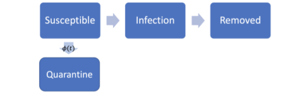
```

---

class: inverse, middle, center

## 谢谢！
---

