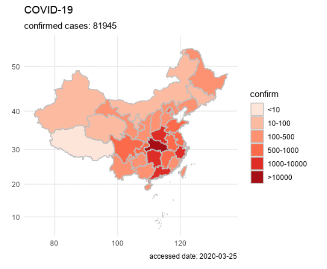
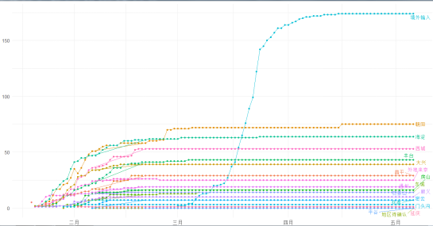
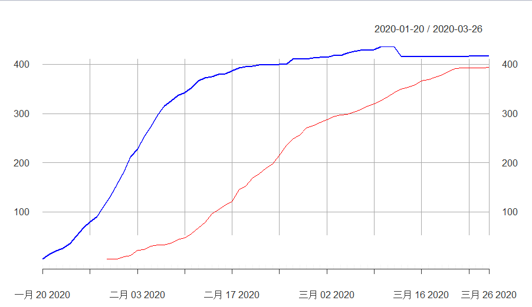
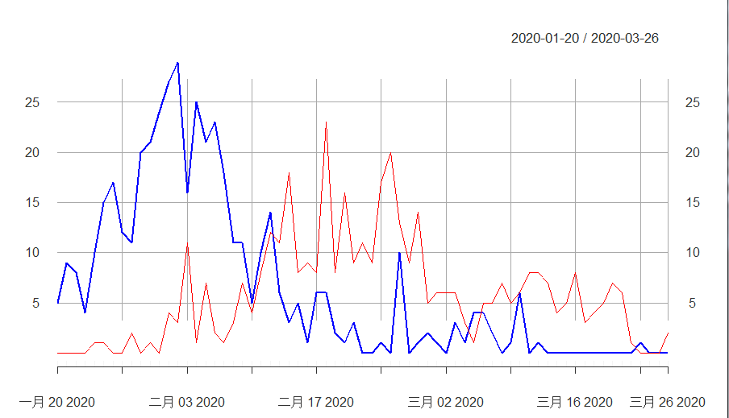
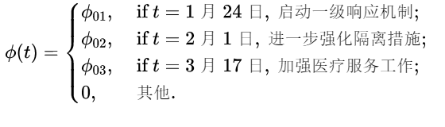
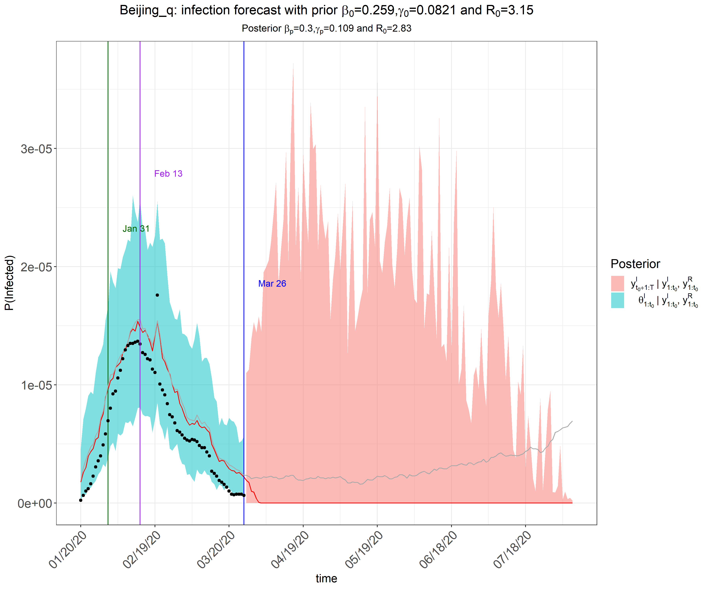
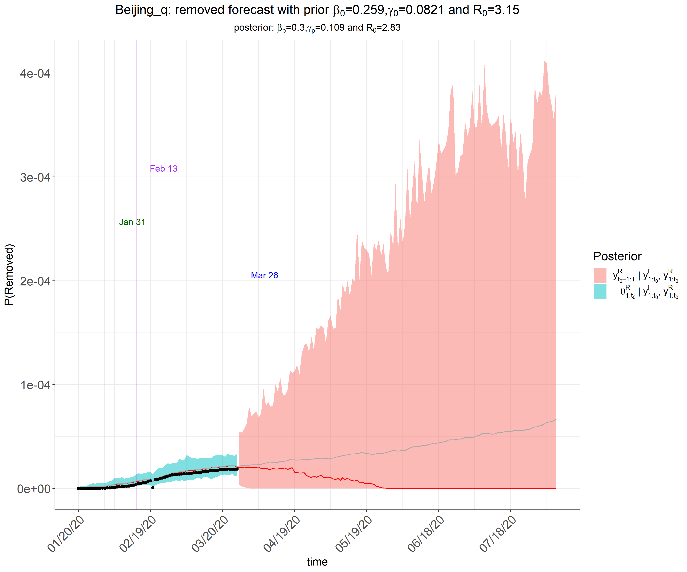
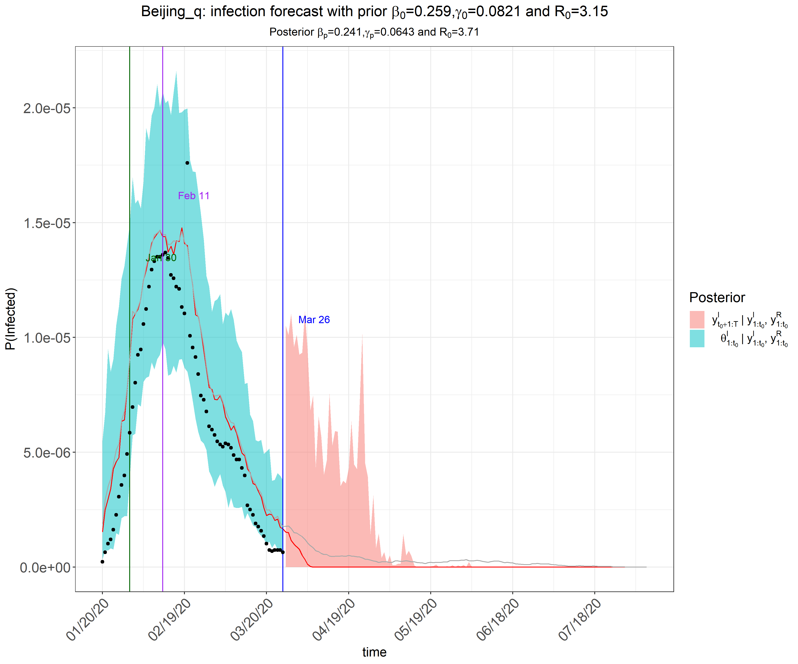
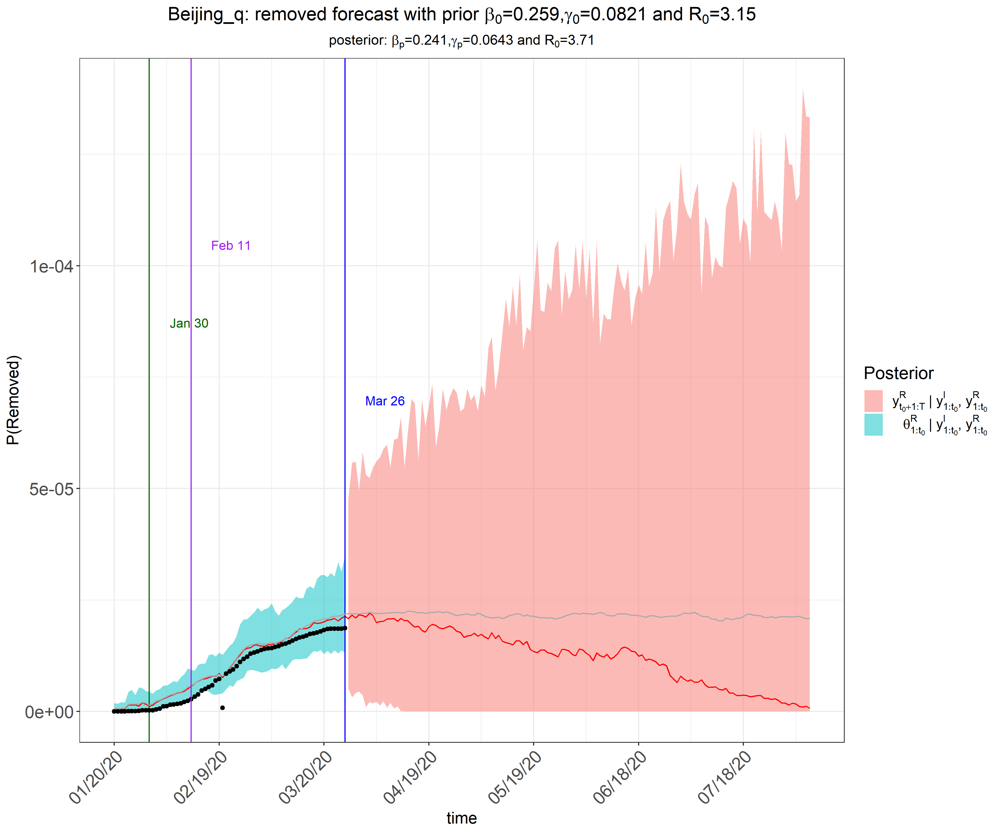

---
title: "细化政府干预的北京疫情预测"
subtitle: "终期报告"
author: "武碧璇 张妍 祁凡 屈亚然 丁晨东"
date: "2020年06月05日"
output:
  xaringan::moon_reader:
    css: [default, zh-CN.css]
    lib_dir: libs
    nature:
      highlightStyle: github
      highlightLines: true
      countIncrementalSlides: false
---


## **展示内容**


### 1.  绪论


### 2.  描述统计


### 3.  模型一

 
### 4.  模型二


### 5.  结论

---
class: inverse, middle, center

## 1. 绪论

---
### 1.1 背景与意义

  这次疫情，是新中国成立以来在我国发生的传播速度最快、感染范围最广、防控难度最大的一次重大突发公共卫生事件。
  
  这次疫情，是一次世界危机、全球灾难。迄今，全球确诊病例近400万例，疫情波及几百个国家和地区……新冠肺炎疫情让世界几乎每个角落都感受到了它的影响。而北京作为我们国家的首都和中心城市，是中国的政治、文化、科教和国际交流中心，由于国际疫情形势日益严峻，北京外来人员流动频繁，因此政府对于易感者、感染者以及移除者的这三个人群的防控显得尤为重要，所以研究北京政府干预对于疫情的影响有重大意义。
   
   本次报告利用了宋学坤教授团队的eSIR包对北京市的疫情做了预测，并对预测效果进行了评估，这对于eSIR包在以后流行病预测中的应用具有一定的意义。
  

---
### 1.2 文献综述

[1] 马尔科夫链在传染病预测中的应用
<https://wenku.baidu.com/view/e2ec6a0f76c66137ee06191a.html>.

论文提出利用马尔可夫链建立传染病预测模型，根据辽宁省干旱地区朝阳市1981年至1993年流行性脑脊髓膜炎的年发病率资料对该预测模型进行了验证,从而得出马尔可夫链传染病预测模型的可靠性以及可信度。

[2] 朱仁杰,唐仕浩,刘彤彤,等.基于改进SIR模型的新型冠状病毒肺炎疫情预测及防控对疫情发展的影响.

论文利用改进的SIR模型对7个疫情较为严重的国家的疫情的发展情况进行模拟和预测，并分析各国控制接触率等防治措施对于疫情发展的影响。
---

[3]喻孜,张贵清等. 基于时变参数-SIR 模型的2019-nCoV疫情评估和预测

文章基于2019-nCoV疫情发展到2月1日所呈现的特点,对SIR模型进行了修正，使用易感再生数、当日感染率和潜伏感染率来求解病毒演化动力学方程，研究了感染人数的变化趋势，并分析了政府行政行为对趋势变化产生的影响。

[4] An epidemiological forecast model and software assessing interventions on COVID-19 epidemic in China.

论文利用中国疾病预防控制中心的公开数据，对湖北省和中国其他地区的冠状病毒流行趋势进行了预测。通过R软件为公众提供了一个工具包eSIR，以便他们使用自己的数据分析疾病传播模式。

https://github.com/lilywang1988/eSIR

---
### eSIR包的介绍

   eSIR包是由宋学坤教授团队开发的，公共卫生工作者可以用它来预测和评估新型冠状病毒传播趋势动态变化过程。该包可以用来预测疫情的转折点，比如感染比例比之前下降的时间点，感染比例比移除比例小的时间点以及疫情结束的时间点。eSIR包是建立在一个分级流行病模型的基础上的，在该模型中每日感染者和移除者的比例来自于基于马尔可夫过程的传染病动力学SIR模型。该包不仅对基本的SIR模型做了拓展，考虑了宏观层面和微观层面的隔离政策，而且还开发了一个校准程序对2月12日及以前的感染者数量进行调整,以此来降低由于漏报问题导致的预测偏差。（校准主要是因为此期间政府只依赖于核酸检测来诊断，但检测经常出现假阴性问题）

---
### 1.3 数据来源及政府干预政策

1.**数据来源**：来自狗熊会


北京市1月20-3月26的数据，包括累计确诊人数，累计治愈和累计死亡人数，以及移除人数(累计治愈人数+累计死亡人数)。  

2.**政策**：来自北京市人民政府<http://www.beijing.gov.cn/ywdt/zwzt/yqfk/>
  

**·**1月24日，北京启动一级响应机制

**·**1月24日-2月1日，交通管制（包括暂停进出北京的长途客运班线和旅游包车，北京铁路局部分旅客列车临时停运，地铁和北京西站实行测温等）

**·**2月1日-3月17日，更进一步的隔离措施（包括各个机构和社区均进行封闭式管理等）
 
**·**3月17日及以后，开展预防接种工作，加强医疗服务工作等
 
---
class: inverse, middle, center

## 2. 描述性统计

---

### 全国感染趋势情况

```{r,echo=FALSE}

```
---

### 北京市感染趋势情况

```{r,echo=FALSE}
knitr::include_graphics("figures/p2.png")
```
 
---

### 北京各区确诊人数曲线图

```{r,echo=FALSE}

```

---

### 北京市确诊人数和治愈人数时序图

```{r,echo=FALSE}

```

---
### 北京市确诊人数与出院人数时序图

```{r,echo=FALSE}

```

---
class: inverse, middle, center

## 3 模型一：修正疾病传播率的SIR模型

---

### 3.1 模型简介

设t时刻, ${q^S}(t)$ 是易感染者在家隔离的概率, ${q^I}(t)$是感染者在医院的概率。新的模型中易感者与感染者相遇时的疾病传播率被修正为：


 $$\beta\lbrace 1-{q^S}(t)\rbrace{\theta_t}^S\lbrace1-{q^I}(t)\rbrace{\theta_t}^I$$


令 $\pi(t)=\lbrace 1-{q^S}(t)\rbrace\lbrace1-{q^I}(t)\rbrace$ 。 $\pi(t)$ 修正了易感者接触感染者的概率，它是由于存在隔离情况的存在而产生的。显然，如果不存在隔离措施，那么 $\pi(t)$ 恒为1。基于以上修正，得到新的SIR模型如下：
 $$\frac{d{\theta_t}^S }{dt} =-\beta \pi(t){\theta_t}^S {\theta_t}^I $$ 
 $$\frac{d{\theta_t}^I }{dt} =\beta \pi(t){\theta_t}^S {\theta_t}^I -\gamma {\theta_t}^I $$
 $$\frac{d{\theta_t}^R }{dt} = \gamma {\theta_t}^I $$


以上修正的SIR模型假定：总体的易感率和感染率是保持不变的，只是减少了易感者与感染者接触的概率 $\pi(t)$ 。

---

上述模型中疾病传播率的修正因子$\pi(t)$是根据地区所采取的隔离措施而特别给定的。 $\pi(t)$ 有可能是阶跃函数，可以反映不同时期政府采取的宏观隔离政策:

```{r,echo=FALSE}
knitr::include_graphics("figures/2.png")

```

当 $\pi_{0}=(\pi_{01},\pi_{02},\pi_{03},\pi_{04})$选择不同的值时，疾病传播率也会不同。上次用的$\pi_{0}$分别为(1,1,1,1),(1,0.8,0.5,0.1),(1,0.9,0.7,0.5)。

也可以被定义为连续函数，可以反映大众稳定增加的自我隔离意识和不断增加的隔离方法，相比于上面所讲的阶跃函数，这是从微观(个人)的角度来反映隔离效应。 
 $\pi(t)$ 可以选择如下指数函数：

$$ \pi(t)=exp(-\lambda_0t) 或者 \pi(t)=exp\lbrace-(\lambda_0t)^v\rbrace $$
上次使用的 $\lambda_0=0.05$ 

---

### 3.2 模型结果

```{r,echo=FALSE}
knitr::include_graphics("figures/infection1.png")
```

之前我们通过比较$\pi(t)$不同取值，对北京疫情情况的预测；得出$\pi_{t}=(1,0.8,0.5,0.1)$可以较好体现政策干预力度。1月24日启动一级响应机制，实施交通管制可以降低20%的疾病传播率；2月1日进一步强化隔离政策，疾病传播率较原来相比降低了50%左右。3月17日，在隔离政策的基础上，加强医疗服务；使得疾病传播率大幅度下降，仅为自然状态下疾病传播率的10%左右。

---
class: inverse, middle, center

## 4 模型二：划分隔离区的拓展的SIR模型

---

### 4.1 模型简介

&emsp;&emsp;上一个模型是在原有SIR模型的基础上引入 $\pi(t)$ 修正因子，修正了易感染者接触感染者的概率，得到了新的SIR模型。本次展示的模型是另一种拓展的SIR模型，它是在原有模型的基础上引入隔离区，如下图所示：
<div align=center>

该模型引入了Quarantine(隔离区)，通俗的认为隔离区内的人是不会与感染者直接接触的人。 $\phi(t)$用于表示易感者愿意在t时刻在家自我隔离的概率,同上面所讲的一样，它也会随着时间而变换。  

---

因此，新的扩展SIR模型如下：

 $$\frac{d{\theta_t}^I}{dt}=\beta{\theta_t}^S {\theta_t}^I -\gamma {\theta_t}^I, \frac{d{\theta_t}^S }{dt} =-\beta {\theta_t}^S {\theta_t}^I -\phi(t){\theta_t}^S$$

 $$\frac{d{\theta_t}^Q}{dt}=\phi(t){\theta_t}^S,\frac{d{\theta_t}^R }{dt} = \gamma{\theta_t}^I$$


以上公式中 ${\theta_t}^S+{\theta_t}^Q+{\theta_t}^I+{\theta_t}^R=1$ 

假定 $\phi(t)$ 是狄拉克函数，并根据实际情况指定如下函数来反映宏观干预政策的影响:



令 $\phi_{0} =(\phi_{01},\phi_{02},\phi_{03})$,本文考虑了两种情况：有多个温和跳跃点( $\phi_{0}=(0.1,0.4,0.4)$)和仅有一个大的跳跃点($\phi_{0}=(0,0.9,0)$ )的情况。

---

### 4.2 建模过程

---

 $\phi_{0}=(0.1,0.4,0.4)$
 
```{r,eval=FALSE}
set.seed(20192020)
library(eSIR)
# cumulative number of infected
NI_complete <- c(5,14,22,26,36,51,68,80,91,111,132,156,183,
                212,228,253,274,297,315,326,337,342,352,366, 
                372,375,380,381,387,393,395,396,399,399,399,  
                400,400,410,410,411,413,414,414,417,418,422,                 
                426,428,428,429,435,435,436,415,415,415,415,
                415,415,415,415,415,415,416,416,416,416)
RI_complete <- c(0,0,0,0,1,2,2,3,5,5,6,6,10,13,24,25,32,
                34,36,39,46,51,59,71,82,101,109,118,126,149,
                157,17,182,193,202,219,239,253,264,279,284,
                290,296,302,305,306,311,316,323,328,334,342,
                350,357,361,366,374,377,381,386,393,399,400,
                400,400,400,402)
N=21.54e6
R <- RI_complete/N
Y <- NI_complete/N- R 
change_time <- c("01/24/2020","02/01/2020","03/17/2020")
phi0 <- c(0.1,0.4,0.4)
res.q <- qh.eSIR(Y, R, begin_str="01/20/2020",
            death_in_R=0.035, T_fin=200,                              phi0=phi0, change_time=change_time, casename="Beijing_q", save_files=T, save_mcmc = F, save_plot_data = F, M=5e2, nburnin = 2e2)
res.q$plot_infection
   
```

---

```{r,echo=FALSE}

```

---

```{r,echo=FALSE}

```

---

 $\phi_{0}=(0,0.9,0)$
 
 
```{r,eval=FALSE}
set.seed(20192020)
library(eSIR)
# cumulative number of infected
NI_complete <- c(5,14,22,26,36,51,68,80,91,111,132,156,183,
                212,228,253,274,297,315,326,337,342,352,366, 
                372,375,380,381,387,393,395,396,399,399,399,  
                400,400,410,410,411,413,414,414,417,418,422,                 
                426,428,428,429,435,435,436,415,415,415,415,
                415,415,415,415,415,415,416,416,416,416)
RI_complete <- c(0,0,0,0,1,2,2,3,5,5,6,6,10,13,24,25,32,
                34,36,39,46,51,59,71,82,101,109,118,126,149,
                157,17,182,193,202,219,239,253,264,279,284,
                290,296,302,305,306,311,316,323,328,334,342,
                350,357,361,366,374,377,381,386,393,399,400,
                400,400,400,402)
N=21.54e6
R <- RI_complete/N
Y <- NI_complete/N- R 
change_time <- c("01/24/2020","02/01/2020","03/17/2020")
phi0 <- c(0,0.9,0)
res.q <- qh.eSIR(Y, R, begin_str="01/20/2020",
            death_in_R=0.035, T_fin=200,                              phi0=phi0, change_time=change_time, casename="Beijing_q", save_files=T, save_mcmc = F, save_plot_data = F, M=5e2, nburnin = 2e2)
res.q$plot_infection
   
```

---

```{r,echo=FALSE}

```

---

```{r,echo=FALSE}

```

---
class: inverse, middle, center

## 5. 结论

---

通过上面对模型分析结果来看，改进的SIR模型对这次疫情发展趋势的预测分析基本可靠，根据政府干预措施进行模型预测与北京市疫情实际情况基本相符，同时可见对于政府采取相关干预措施，例如启动响应机制，进行交通管制以及进行居家隔离等对于疫情的防控非常有效。  

另外，从利用不同的权数赋予政府干预的结果来看，政府采取干预措施强度和程度的不同对疫情防控的影响程度也不同，所以，对国内而言，每省（市）的可根据本省（市）的情况来决定采取何种程度的干预措施。

---
class: inverse, middle, center

## 谢谢！


