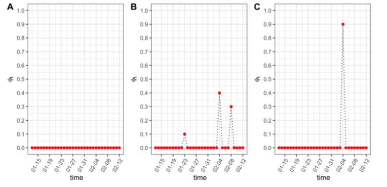

---
title: "细化政府干预的北京疫情预测"
subtitle: "终期报告"
author: "武碧璇 张妍 祁凡 屈亚然 丁晨东"
date: "2020年06月08日"
output:
  xaringan::moon_reader:
    css: [default, zh-CN.css]
    lib_dir: libs
    nature:
      highlightStyle: github
      highlightLines: true
      countIncrementalSlides: false
---


## **展示内容**


### 1.中期结果


### 2.模型优化


### 3.模型结果


### 4.结论

---
class: inverse, middle, center

## 1.中期结果

---
```{r,echo=FALSE}
knitr::include_graphics("figures/infection1.png")
```

&emsp;&emsp;之前我们通过比较$\pi(t)$不同取值，对北京疫情情况的预测；得出$\pi_{t}=(1,0.8,0.5,0.1)$可以较好体现政策干预力度。1月24日启动一级响应机制，实施交通管制可以降低20%的疾病传播率；2月1日进一步强化隔离政策，疾病传播率较原来相比降低了50%左右。3月17日，在隔离政策的基础上，加强医疗服务；使得疾病传播率大幅度下降，仅为自然状态下疾病传播率的10%左右。

---
class: inverse, middle, center

## 2.划分隔离区的拓展的SIR模型

---
&emsp;&emsp;上一个模型是在原有SIR模型的基础上引入$\pi(t)$修正因子，修正了易感染者接触感染者的概率，得到了新的SIR模型。本次展示的模型是另一种拓展的SIR模型，它是在原有模型的基础上引入隔离区，如下图所示：


&emsp;&emsp;该模型引入了Quarantine(隔离区)，通俗的认为隔离区内的人是不会与感染者直接接触的人。 $\phi(t)$ 用于表示易感者愿意在t时刻在家自我隔离的概率,同上面所讲的一样，它也会随着时间而变换。因此，新的扩展SIR模型如下：

 $$\frac{d{\theta_t}^I}{dt}=\beta{\theta_t}^S {\theta_t}^I -\gamma {\theta_t}^I, \frac{d{\theta_t}^S }{dt} =-\beta {\theta_t}^S {\theta_t}^I -\phi(t){\theta_t}^S$$

 $$\frac{d{\theta_t}^Q}{dt}=\phi(t){\theta_t}^S,\frac{d{\theta_t}^R }{dt} = \gamma{\theta_t}^I$$


以上公式中 ${\theta_t}^S+{\theta_t}^Q+{\theta_t}^I+{\theta_t}^R=1$ 

---
class:middle, center
假定 $\phi(t)$ 是狄拉克函数，并根据实际情况指定如下函数来反映宏观干预政策的影响:


令 $\phi_{0} =(\phi_{01},\phi_{02},\phi_{03})$,本文考虑了三种情况：不加干预的情况( $\phi_{0}=(0,0,0)$ )，以及有多个跳跃点( $\phi_{0}=(0.1,0.4,0.3)$)和仅有一个跳跃点( $\phi_{0}=(0,0.9,0)$ )的情况。



---


## 3.模型结果

---
本次结结果
&emsp;&emsp;
&emsp;&emsp;


------
class: inverse, middle, center

## 4.结论

---
&emsp;&emsp;
&emsp;&emsp;


---

class: inverse, middle, center

## 谢谢！
---

